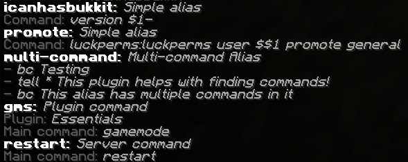

# Bukkit-whereis

## About

Simple Unix-like whereis command that tells you what provides a command. This plugin provides one simple `/whereis` command that obtains information about a command or alias.  
For commands provided by a plugin, it will tell what plugin provides the command, and what the main command is. The main command can differ, for example `/gms` from Essentials actually points to `/gamemode`.  
For aliases, it will show what the alias is set to, with all the commands if there are more than one.  
For built-in server commands it will report it as a server command.  

## Usage
The command needs the `whereis.whereis` permission to be used, since this can reveal information about your server.  
To use the command, just type `/whereis` followed by the command you want to get this info about.  

## Example
